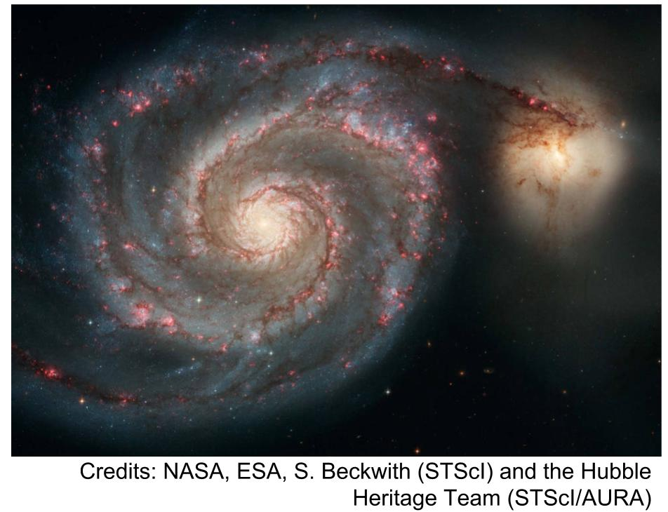

# Research

My research focuses on approximate Bayesian inference. 

My primary application domain lies in variational inference for 
large-scale astronomy datasets. A current project involves deep generative modeling for telescope images of galaxies. I combine ideas from deep learning, Bayesian probabilistic modeling, and physics knowledge for the detection of gravitational lensing. 

I also work on methods for efficient quantification of Bayesian sensitivity to prior specifications in the context of variational inference.

## Publications 

**Liu R.**, McAuliffe J. D., Regier J. "Variational Inference for Deblending Crowded Starfields."  [https://arxiv.org/abs/2102.02409](https://arxiv.org/abs/2102.02409). 

**Liu R.**, Regier J., Tripuraneni N., Jordan M. I., McAuliffe J. D. "Rao-Blackwellized Stochastic Gradients for Discrete Distributions." *International Conference on Machine Learning*. June 2019. [https://arxiv.org/abs/1810.04777](https://arxiv.org/abs/1810.04777). 

Giordano R., Stephenson W., **Liu R.**, Jordan M. I., Broderick T. “A Swiss Army Infinitesimal Jackknife
.” *International Conference on 
Artificial Intelligence and Statistics*. April 2019. [https://arxiv.org/abs/1806.00550](https://arxiv.org/abs/1806.00550).  
 -- Selected for Notable Paper Award and oral presentation. 

**Liu R.**, Giordano R., Jordan M. I., Broderick T. “Evaluating Sensitivity to the Stick Breaking Prior in Bayesian Nonparametrics.” *NIPS, All of Bayesian Nonparametrics Workshop.* December 2018.  [https://arxiv.org/abs/1810.06587](https://arxiv.org/abs/1810.06587). 
 -- Selected for ISBA@NIPS  Award and contributed talk. 
        
Giordano R., **Liu, R.**, Varoquaux N., Jordan M. I., Broderick T. “Measuring Cluster Stability for Bayesian Nonparametrics Using the Linear Bootstrap.” *NIPS, Advances in Approximate Bayesian Inference Workshop*. December 2017. [https://arxiv.org/abs/1712.01435](https://arxiv.org/abs/1712.01435).

